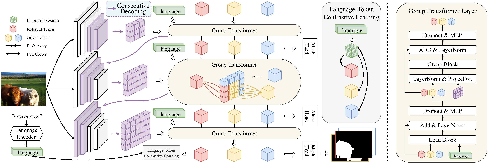

# CGFormer
The official PyTorch implementation of the CVPR 2023 paper "Contrastive Grouping with Transformer for Referring Image Segmentation".

This paper first introduces learnable query tokens to represent objects and then alternately queries linguistic features and groups visual features into the query tokens for object-aware cross-modal reasoning. CGFormer achieves cross-level interaction by jointly updating the query tokens and decoding masks in every two consecutive layers. In addition, we introduce new splits on datasets for evaluating generalization for referring image segmentation models.

## Framework
<p align="center">
  
</p>

## Preparation

1. Environment
   - [PyTorch](www.pytorch.org) 
   - Other dependencies in `requirements.txt`
2. Datasets
   - The detailed instruction is in [prepare_datasets](data/READEME.md)
3. Pretrained weights
   - [Swin-Base-window12](https://github.com/SwinTransformer/storage/releases/download/v1.0.0/swin_base_patch4_window12_384_22k.pth)

## Train and Test (RIS)

This implementation only supports **multi-gpu**, **DistributedDataParallel** training, which is faster and simpler; single-gpu or DataParallel training is not supported. Besides, the evaluation only supports single-gpu mode.

To do training of CGFormer with 8 GPUs, run:

```
python -u train.py --config config/config.yaml
```

To do evaluation of CGFormer with 1 GPU, run:
```
CUDA_VISIBLE_DEVICES=0 python -u test.py \
      --config config/refcoco/config.yaml \
      --opts TEST.test_split val \
             TEST.test_lmdb path/val.lmdb
```
## License

This project is under the MIT license. See [LICENSE](LICENSE) for details.


## Citation
If you find our work useful in your research, please consider citing:
```
@InProceedings{Tang_2023_CVPR,
    author    = {Tang, Jiajin and Zheng, Ge and Shi, Cheng and Yang, Sibei},
    title     = {Contrastive Grouping With Transformer for Referring Image Segmentation},
    booktitle = {Proceedings of the IEEE/CVF Conference on Computer Vision and Pattern Recognition (CVPR)},
    month     = {June},
    year      = {2023},
    pages     = {23570-23580}
}
```

Some code changes come from [CRIS](https://github.com/DerrickWang005/CRIS.pytorch/tree/master) and [LAVT](https://github.com/yz93/LAVT-RIS).
